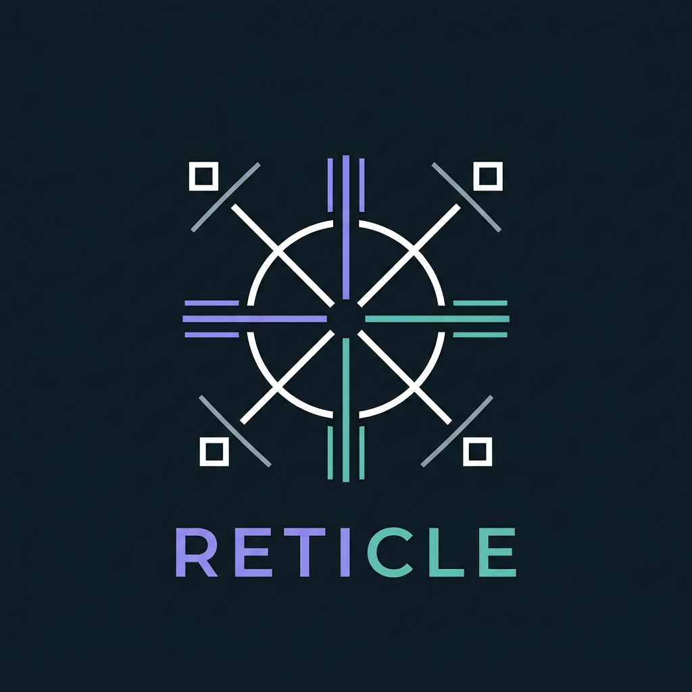
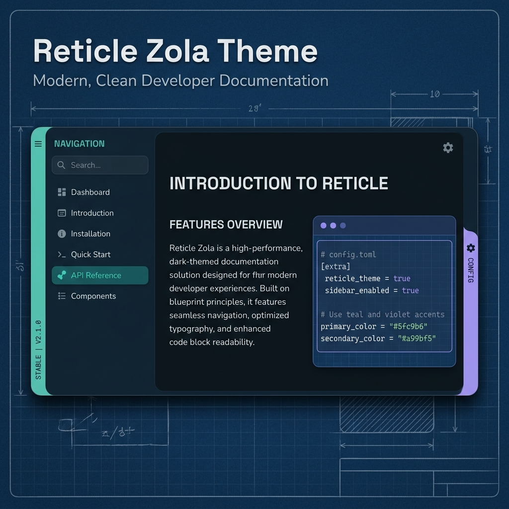

<div align="center">

<h1 align="center">
  
  <br>
  Reticle
</h1>

<p align="center">
  <em>An instrument-reading design system for Zola — Space Grotesk + Nunito + Cascadia Code typography, semantic state accents (proved/obligation/blocking), and the margin-tape signature element. Supports documentation (with versioning), e-books, blogs, and product landing pages.</em>
</p>

<p align="center">
  <a href="https://www.getzola.org/">
    
  </a>
  <a href="tokens/reticle.css">
    
  </a>
  <a href="sass/base/_fonts.scss">
    
  </a>
  <a href="LICENSE">
    
  </a>
</p>

<p align="center">
  <a href="https://lokeshmohanty.github.io/reticle">Live Demo</a> •
  <a href="https://lokeshmohanty.github.io/reticle/docs/">Documentation</a> •
  <a href="https://lokeshmohanty.github.io/reticle/book/">Book Example</a> •
  <a href="https://lokeshmohanty.github.io/reticle/blog/">Blog Example</a>
</p>

<hr />

</div>



## Features

- **Four Modes** — Documentation (with versioning), Book, Blog, and Product Landing Page layouts
- **Instrument-Reading Color System** — Cool blueprint-paper ground (`--paper`), petrol ink (`--ink`), and 3 semantic accents (`--proved`, `--obligation`, `--blocking`)
- **Three-Role Typography** — **Space Grotesk** (display headings), **Nunito** (prose body text), and **Cascadia Code** (utility voice: dates, counts, IDs, tags, code)
- **Signature Margin Tape** — 3px left status rail (`.tape`) for scanability without noisy badge clutter
- **Portable Tokens** — Standalone CSS custom properties (`tokens/reticle.css`) & TOML palettes (`tokens/reticle-dark.toml`, `tokens/reticle-light.toml`)
- **Resizable Sidebar** — Drag to resize documentation sidebar, persists across user sessions
- **Full-Text Search** — Elasticlunr-powered instant client-side search with modal overlay
- **Dark/Light Theme** — Seamless three-way toggle (`dark` / `light` / `auto`) with system preference detection
- **Keyboard Navigation** — `/` for search, `Esc` to dismiss, arrow key page navigation
- **SEO & Accessibility** — JSON-LD structured schemas, ARIA landmarks, OpenGraph, Twitter Cards, semantic HTML5

## Portable Tokens

Reticle ships standalone design system tokens under `tokens/` that can be imported into any application or used across other projects:

```css
/* Import in any web app — no build step required */
@import "path/to/tokens/reticle.css";
```

Or consume the TOML theme files (`tokens/reticle-dark.toml`, `tokens/reticle-light.toml`) for terminal, editor, or desktop client theming.

## Installation

```bash
cd your-zola-site
git clone https://github.com/lokeshmohanty/reticle themes/reticle
```

Or as a Git submodule:

```bash
git submodule add https://github.com/lokeshmohanty/reticle themes/reticle
```

## Quick Start

### Documentation Mode

```toml
base_url = "https://docs.example.com"
title = "My Project Docs"
theme = "reticle"
build_search_index = true

[markdown]
highlight_code = true
highlight_theme = "css"

[extra]
mode = "docs"
github = "https://github.com/you/project"

# Optional: version picker
[extra.versions]
current = "2.0.0"
list = [
    { version = "2.0.0", url = "/", label = "latest" },
    { version = "1.0.0", url = "/v1/" },
]
```

### Book Mode

```toml
base_url = "https://book.example.com"
title = "The Complete Guide"
theme = "reticle"
build_search_index = true

[markdown]
highlight_code = true
highlight_theme = "css"

[extra]
mode = "book"
github = "https://github.com/you/book"
```

### Blog Mode

```toml
base_url = "https://blog.example.com"
title = "My Blog"
theme = "reticle"
generate_feeds = true

taxonomies = [
    { name = "tags", feed = true },
]

[markdown]
highlight_code = true
highlight_theme = "css"

[extra]
mode = "blog"

[extra.hero]
title = "Welcome to my blog"
subtitle = "Thoughts on code and craft"

[[extra.nav]]
name = "Blog"
url = "/blog/"

[[extra.nav]]
name = "About"
url = "/about/"
```

## Development

This repository includes a Nix flake (`flake.nix`) and dev environment.

```bash
# Enter development shell (provides Zola and Just)
nix develop

# Serve example sites with Just
just serve-blog   # Serve blog on http://127.0.0.1:1113
just serve-docs   # Serve docs on http://127.0.0.1:1111
just serve-book   # Serve book on http://127.0.0.1:1112

# Build all example sites into public/
just build
```

## Keyboard Shortcuts

| Key | Action |
|-----|--------|
| `←` / `→` | Previous / Next page |
| `/` | Open search modal |
| `Esc` | Close search / navigation overlays |

## Credits

- **Original theme structure**: Inspired by Zola theme patterns by Raffael Schneider ([raskell.io](https://raskell.io))
- **Design System & Palette**: Reticle Instrument-Reading system by Lokesh Mohanty
- **Typography**: [Space Grotesk](https://github.com/floriankarsten/space-grotesk), [Nunito](https://github.com/googlefonts/nunito), [Cascadia Code](https://github.com/microsoft/cascadia-code)
- **Iconography**: [Lucide Icons](https://lucide.dev)
- **Engine**: [Zola Static Site Generator](https://www.getzola.org)

## License

[MIT](LICENSE)

---

<p align="center">Built with care by <a href="https://lokeshmohanty.in">Lokesh Mohanty</a></p>
